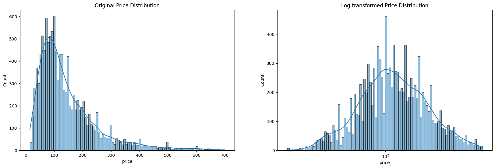
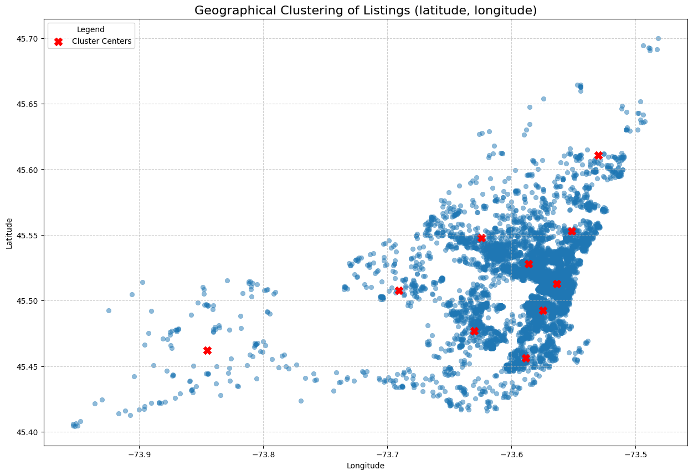
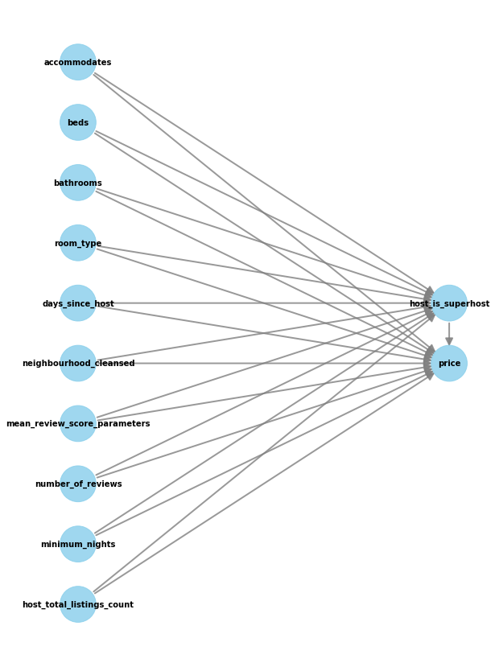

# Airbnb Price Predictor

## Main Objective

The primary objective of this project is to build a model that can accurately predict the price of an Airbnb listing in Montreal, QC, Canada, with a goal of serving both hosts and guests by providing a data-driven price estimate for a listing. This will help hosts to set a competitive price for their listing and help guests to make an informed decision when booking a listing. This project utilizes regression analysis to predict the price of an Airbnb listing based on various features, along with a causal inference analysis to identify the impact of certain features on the price of a listing.

## Project Steps

### 1. Data Preprocessing

1. **Data Collection & Cleaning:** Data for the specified months was collected from the [data source](#dataset-source). Subsequently, thorough data cleaning was conducted by removing irrelevant columns, handling missing values, and standardizing data types to ensure data integrity and compatibility with machine learning models.
2. **Exploratory Data Analysis:** Conducted a detailed exploratory data analysis to understand the dataset's structure, distribution of features, and inter-variable relationships. This included creating visualizations for both numerical and categorical data to identify underlying patterns and trends. The distribution of the target variable is shown below: 

    For more detailed analysis, please see the EDA section of the notebook [here](./Assignment%202/261149449_Airbnb_Price_Prediction_A2.ipynb)

3. **Feature engineering:**  Engaged in feature engineering to extract meaningful information from existing features. This included creating new features based on domain knowledge, such as calculating the number of bathrooms from the `bathrooms_text` column, deriving host experience from the `host_since` feature, utilizing amenities of a listing as categorical features, and clustering listings based on location and neighbourhood, as shown below: 

    All feature engineering was then moved to using `scikit-learn` [Pipeline](https://scikit-learn.org/stable/modules/generated/sklearn.pipeline.Pipeline.html) objects to make the analysis reproducible and valid.

### 2. Model Development

1. **Regression Models:** Various regression models were implemented and evaluated, including Linear Regression, Decision Tree Regressor, Random Forest Regressor, and Gradient Boosting Regressor. Model selection and hyperparameter tuning were carried out using Grid Search and Cross-Validation methods to enhance model performance.
2. **Model Evaluation:** Assessed the performance of the regression models using appropriate evaluation metrics such as Root Mean Squared Error (RMSE). Compared the models' performance to select the best-performing model for price prediction.

   A final RMSE of 89.60, with a 95% confidence interval of [82.36, 96.30] was obtained.

3. **Feature Importances:** The top features, in decreasing order of importance, are:
    - **Accomodates**: The number of people that can be accomodated in the listing is the most important feature. This is intuitive, since the price of a listing should depend on the number of people that can stay in it.
    - **Minimum nights**: The minimum number of nights that a guest can stay in the listing is the second most important feature. This is also intuitive, as listings that have a higher minimum number of nights are usually less expensive as they are more suitable for long-term stays.
    - **Room type**: The type of room is the third most important feature. Listings that are entire homes/apartments tend to be more expensive than other type of rooms as they provide more privacy.
    - **Cluster similarity**: The next most important feature is the location of the listing, which has been computed as the similarity to each cluster. In this particular case, the most important cluster is cluster 0, which is located in Ville-Marie (Downtown), where the most expensive listings are located.

After model development, training, and validation was conducted, the final model was saved using [`joblib`](https://scikit-learn.org/stable/model_persistence.html).

### 3. Causal Inference

Causal inference techniques were applied, using [DoWhy](https://www.pywhy.org/dowhy/v0.11.1/), to estimate the treatment effect of key attributes of a listing on its price. More specifically, the impact of superhost status was assessed. A backdoor linear regression was conducted to estimate the Average Treatment Effect (ATE) of being a [Superhost](https://www.airbnb.ca/help/article/828) on listing price, while accounting for confounding factors, as shown below: 

The analysis showed, with statistical significance, that superhost listings command a **price premium of ~$8.6**, on average, compared to non-superhost listings. To make the analysis robust, multiple tests were conducted, such as adding a random common cause, and running bootstrap estimation. For more details, please see the notebook [here](./Assignment%202/261149449_Airbnb_Causal%20Inference_A2.ipynb)****

## Business Value and Applicability

The findings of this project offer valuable insights for both Airbnb hosts and guests in Montreal:

- **Pricing Recommendations for Hosts:** The price prediction model can assist hosts in setting competitive prices for their listings based on the property's features and market trends. This can help optimize occupancy rates and maximize revenue, while helping property developers estimate return on investment.

- **Informed Decision-Making for Guests:** The model's price predictions can guide guests in assessing the fairness and value of listing prices. This transparency empowers guests to make informed booking decisions and find listings that align with their preferences and budget.

- **Causal Insights for Listing Optimization:** The causal inference results provide actionable insights for hosts to optimize their listings. By understanding the impact of specific features on pricing, hosts can make data-driven decisions to enhance their listings and attract more bookings.

The project's findings contribute to a more efficient and transparent Airbnb marketplace in Montreal, benefiting both hosts and guests by facilitating fair pricing and informed decision-making.

## Dataset Source

The project utilizes the Montreal dataset obtained from [Inside Airbnb](https://insideairbnb.com/get-the-data/). The data source contains information about Airbnb listings in multiple cities, including property details, host information, pricing, and reviews.
